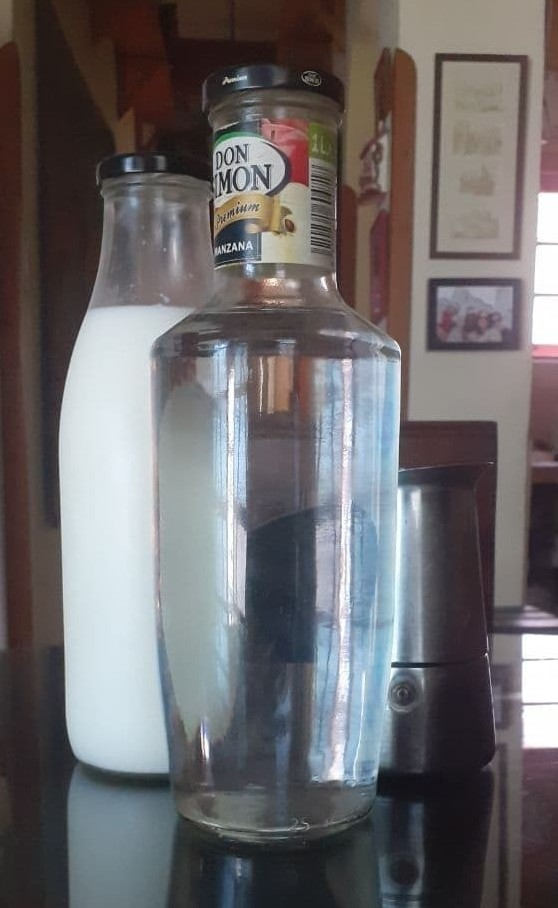
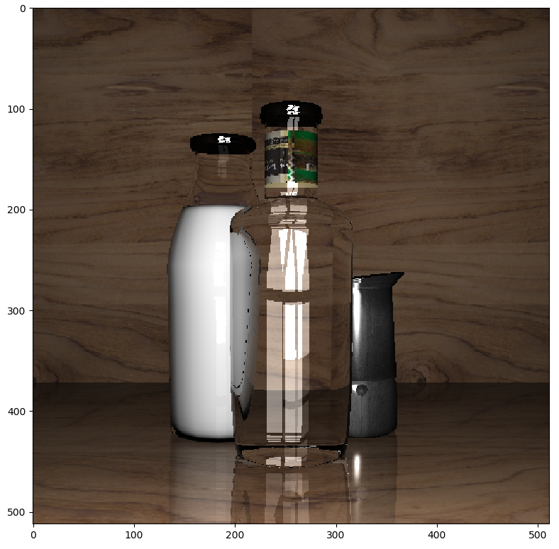
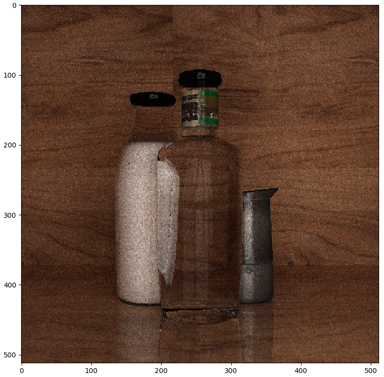
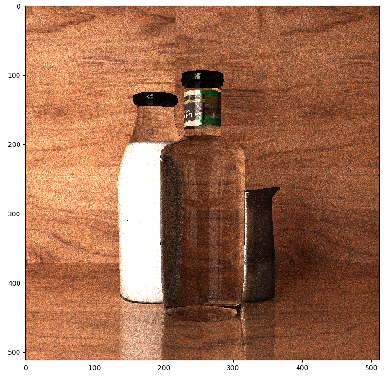
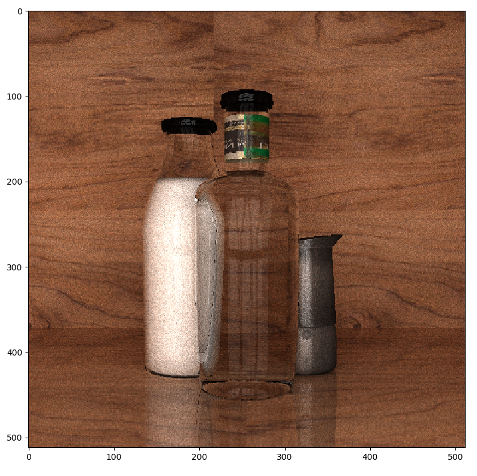
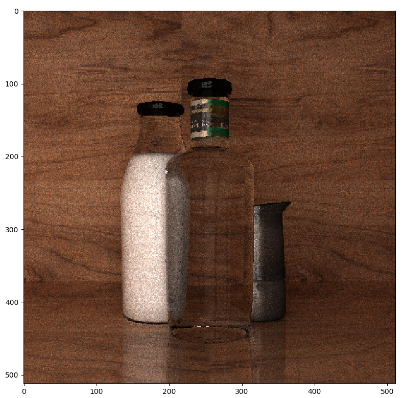
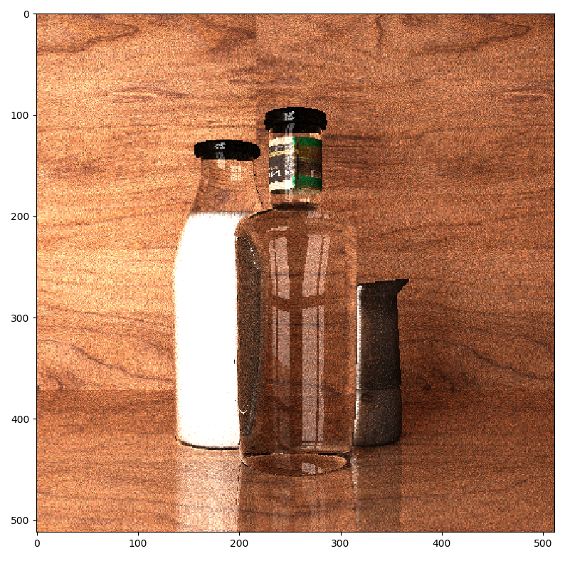
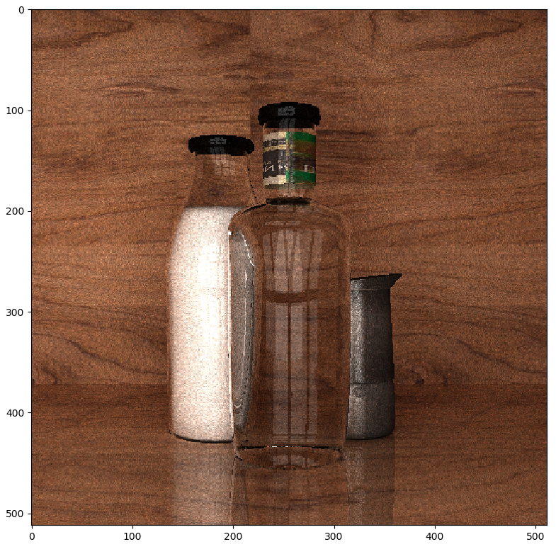
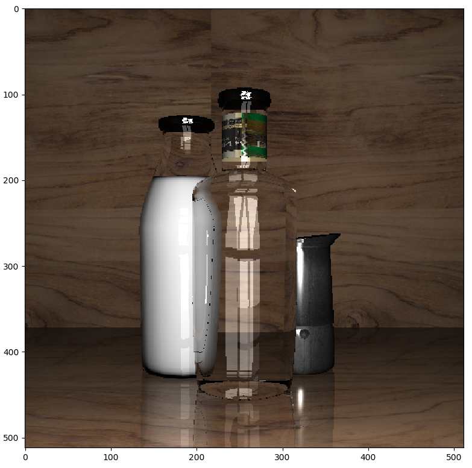

# Proyecto CG 2021

#### Rodrigo Daniel Pino Trueba C-412 

### Imágenes

El objetivo del proyecto es modelar a través de una escena real una escena renderizada por computadora. Se utilizaron dos técnicas de renderizado _pathtracing_ y _raytracing_:

**Escena a modelar:**

**Renderizado utilizando raytracing:**

**Renderizado utilizando pathtracing:**

### Modelos

Para la modelación de la escena se utilizo la clase `Mesh`. Los tres modelos principales representados son el resultado de la unión de otros modelos. 

Para la unificación de los modelos se utilizo el metodo implementado `MorphMeshes`. Unir las distintas mallas permite lograr un mejor efecto cuando la luz inside sobre estos, y puede hacer disimular mejor las discontinuidades. Ademas es posible envolver una textura sobre un conjunto de mallas a la vez.

**Botella de Leche**

Constituido por tres modelos. Uno para representar la tapa, otro para representar la forma curva del cuello de la botella y otro para representar el resto. Estas figuras fueron construidas utilando `BezierCurves`.

La leche del interior de la botella constituye una version truncada y muy ligeramente empequeñecida del recipiente que las contiene.  

**Botella de Agua**

Esta botella al igual que contiene leche, constituye la unión de varias formas, la mayoria lograda con `BezierCurves`. La etiqueta y el cuello de la botella se crearon utilizando el metodo `CreateCyllinder`. La etiqueta en realidad son dos cilindros con las normales invertidas, para que en el momento de texturizar de la impresión de ser un solo cilindro con ambas caras texturizadas.

**Cafetera**

El cuerpo principal de la cafetera fue moldeado utilizando `BezierCurves`. El pequeño círculo debajo de la unión fue generado utilizando `CreateCircle`. Para crear la parte superior o pico por donde se vierte el cafe se utilizo `CreateCartesianOval`  que realiza una "generación sucesiva" de óvalos cartesianos, uno encima del otro, donde el $\displaystyle i-\text{ésimo óvalo}$ se estira un poco mas en dirección del eje $z^+$ (y en menor medida tambien para $z^-, x^+$ y $x^-$)  con respecto al óvalo $i-1$.

**Fuente de Luz**

Para imitar la fuente de luz de la escena, detras de la cámara hay situados 8 rectángulos obtenidos a traves de `CreatePlane` que simulan 2 columnas de ventanas que son las encargadas de transmitir luz a la escena.

**Escena**

La escena consiste en un piso, una pared de fondo y dos parede laterales, todas creadas con el metodo incorporada al poyecto `CreatePlane`. Las paredes laterales no son visibles, no obstante ayudan a mantener los rayos de luz dentro de la escena durane el _pathtracing_.

### Texturas

**Botellas de Cristal**

Tanto la botella de agua y la de leche estan compuestas de este material. La única diferencia entre estas es que la botella de leche tiene un menor índice de refracción.

**Leche y Tapas**

Ambas son texturas de un color entero, con la diferencia de que la leche presenta una superficia más opaca que no refleja la luz y la tapa posee un factor glossy.

**Cafetera y Etiqueta**

La cafetera se texturiza entera con una imagen de metal extraida de internet. Además tiene un factor glossy para reflejar la luz.

Para texturizar la etiqueta se siguió el mismo procedimiento que para la cafetera.

**Pared y Piso**

Ambas utilizan la imagen "wood.jpg" que viene por defecto junto con el proyecto. El piso en particular tiene un factor mirror para lograr una mayor semejanza con la escena.

### Otras Imágenes

Como una pequeña adición se muestran en esta sección imágenes obtenidas durante el proceso de realización del proyecto con detalles modificados como la posición de la fuente de luz, el índice de refracción o el specular power.

